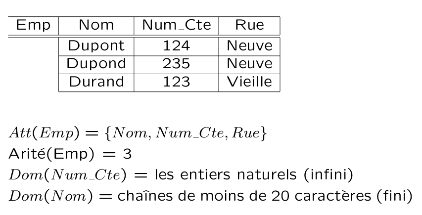
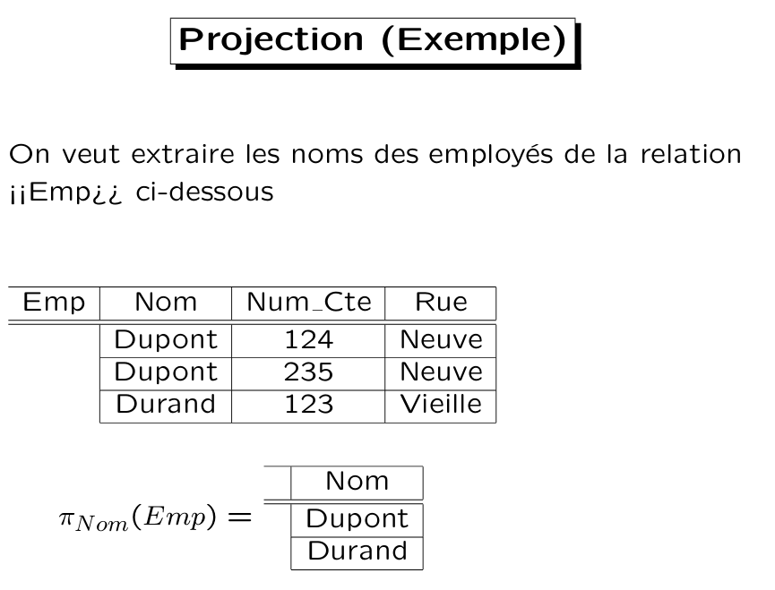
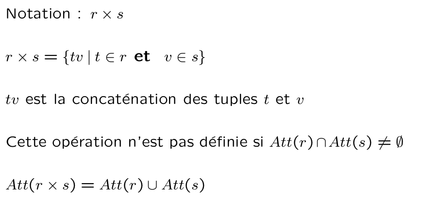

# Base de donnée

Mail : maabout@labri.fr

Réf PDF : www.labri.fr/~maabout/M1BI

## I-Définitions
### Une base de donnée relationnelle
Une relation est une **table** (tableau) où chaque colonne définie un **attribut** (ou champ) et chaque ligne désigne un **enregistrement** (tuple ou n-tuplet).
Chaque relation a un **nom**.

**Contraintes**:
+ 2 relations de la même BD ont forcément des noms différents.
+ 2 attributs de la même relation ont forcément des nom différents
Remarque : 2 attributs qui se trouvent dans 2 tables différentes peuvent avoir le même nom.

*Exemple*:
Dans une base, on peut avoir des tables:
+ Employé (**N°SS**,Nom,Ville,Salaire,*N°Service*)
+ Service (*N°Service*,Nom,Etage,**Responsable**)

Note : 
+ N°Service permet d'établir une relation entre l'employé et le service. 
+ Nom est différent entre les deux tables. 
+ Responsable devra utiliser un lien unique pour identifier un employé : deux attributs ont un nom différent mais ont la même info (N°SS).

### Système de gestion de base de données (SGBD)
Système (logiciel) qui permet de gérer des bases données.
+ Créer 
+ Modifier
+ Interroger 

*Exemple de SGBD*: MySQL, **Postgres**, Access, SQL Servor, Oracle , ...

## II-Langage de requête
### 1-Algebre relationnelle
Composée d'un ensemble d'**opérations**. Certaines sont **unaires** (une seule table comme paramètre), d'autres sont **binaires** (exemple : addition est une opération binaire).

#### 1.1-Projection
Prend une table et supprime certaines colonnes.

*Notation* : 

Noter que par défaut les doublons ne sont pas éliminés mais il est possible de spécifier une option afin de les éviter (50 employés à Pessac et 20 à Bx : Ville? on aura une table avec deux lignes Bx et Pessac).

#### 1.2-Sélection
Permet d'extraire des lignes d'une table qui satisfait une condition.

*Notation*:

*Exemple*:

#### 1.3-Produit cartésien:
Permet de **concaténer** chaque ligne d'une table à chaque ligne d'une deuxième table.

*Notation*:

*Remarques* : 
+ les attributs de la table résultant du produit sont ceux de 2 tables.
*Exemple* : R(A,B) * S(C,D,E) => Résultat(A,B,C,D,E)

Note : Nombre de ligne de Résultat = nombre de ligne de R * nombre de ligne de S

+ Cas où un même nom d'attribut apparaît dans les 2 tables : 

Ex : R(A,B) \* S(B,C) => Résultat(A,**R.B**,**S.B**,C)

+ le résultat de chaque opération de l'algèbre est une table. On peut donc combiner plusieurs opéartions successives.

Ex : afficher le nom des employés habitant Pessac.

&pi;;Nom (SIGMAVile = Pessac)(Employé)) => Résultat = {"Nom" :[Dupont,Martin]}

On a d'abord fait une sélection et on a ensuite appliqué la projection.

Ex : afficher le nom des employés qui travaillent au Service Compta. 
+ On extrait le n° du Service dont le nom est Compta.

&pi;N°Service (SIGMANomService = Compta(Service)) => Res1 : {"N°Service" : [1]}

+ On combine Res 1 avec Employé :

Employé * Res1 => Res2 = {"N°SS":[123,321,312],"Nom":[Dupond,Dupont,Martin],"Ville":[Bx,Pessac,Pessac],"Employé.N°Service":[1,1,2],"Res1.N°Service":[1,1,1]}

+ On sélectionne le nom des employés où il y a égalité des N°Service.

&pi;Nom (SIGMAEmployé.N°Service = Res1.N°Service(Res2)) => Res3={"Nom":[Dupond,Dupond]}

#### 1.4-Jointure
C'est un cas particulier de produit cartésien : 2 lignes sont concaténées si et seulement si elles ont les mêmes valeurs sur les attributs communs : 

*Notation* : 

*Exemple* :

#### 1.5-Renommage
Permet de changer le nom d'un ou de pluseiurs attributs.

*Notation* : 

*Exemple*

Ex : &pi;Nom (SIGMANom Service = Compta(RHOResp => N°SS(Service)**jointure**Employé))

#### 1.6-Opération ensembliste : Union, Intersection, Différence
*Notation* : 

*Exemple* : 

Ex : 
+ Afficher le nom et N°SS des employés qui sont aussi étudiants 

&pi;N°SS,Nom(Employé) **intersection** &pi;N°SS,Nom(Etudiant)

+ Afficher les étduiants qui ne sont pas employés

&pi;N°SS,Nom(Etudiant) __ &pi;N°SS,Nom(Employé)

+ Afficher les personnes qui ont une adresse mail à l'université

&pi;N°SS,Nom(Employé) **union** &pi;N°SS,Nom(Etudiant)

### TD-1 : Requêtes 
1- Afficher le nom des personnes qui habitent Koudalou

+ &pi;NomOccupant(SIGMANomImmeuble=Koudalou(Occupant))

2- Afficher le nom des immeubles.

NomImmeuble : attribut retourvé dans table Immeuble, Appart et Occupant. Mais la table Immeuble est censé contenir tous les immeubles : projection.

+ &pi;NomImmeuble(Immeuble)

3- Superficie de l'appart occupé par Rachel

+ Occupant **jointure** Appart => 5 lignes et 6 colonnes
+ &pi;Superficie(SIGMANomOccupant = Rachel(Occupant **jointure** Appart))

*Remarque* : on a le même résultat avec 
+ &pi;Superficie(SIGMANomOccupant = Rachel(Occupant) **jointure** Appart) 

4- Profession du gérant de l'immeuble où Rachel habite

+ SIGMANomOccupant = Rachel(Occupant) => Res1
+ Res1 **jointure** Immeuble => Res2 (1 ligne et 8 colonnes)
+ RHONomGérant => Nom => Res3 
+ Res3 **jointure** Personne => Res4 (1ligne et 10 colonnes)
+ &pi;Profession(Res4) 

**Résultat**:

|Profession|
|---------|
|Rentier|

5- Afficher la superficie de l'appart occupé par Rachel ainsi que la profession du gérant de cet appart

+ SIGMANomOccupant = Rachel(Occupant) => Res1
+ Res1 **jointure** Appart => Res2
+ Res2 **jointure** Immeuble => Res3
+ RHONomGérant => Nom => Res4 
+ Res4 **jointure** Personne => Res5
+ &pi;Superficie,Profession(Res5) 

6- Afficher ke N° et le nom d'immeuble des apparts qui ne sont pas occupés

+ &pi;NomImmeuble,N°Appart(Appart) - &pi;NomImmeuble,N°Appart(Occupant)

7- Le nom des immeubles dont tous les apparts sont occupés.

*Principe* : l'ensemble de tous les immeubles moins ceux qui ont au moins un appartement libre

+ &pi;NomImmeuble(Immeuble) => Res1
+ &pi;NomImmeuble(&pi;NomImmeuble,N°Appart(Appart) - &pi;NomImmeuble,N°Appart(Occupant)) => Res2
+ Res1 - Res2 

**Resultat** : 

|NomImmeuble|
|---------|
|Barabas|
 
 8- Afficher les paires de personnes qui sont voisines cad habitent le même immeuble

+ &pi;NomImmeuble,NomOccupant(Occupant) => Res1

|NomImmeuble|NomOccupant|
|-----------|-----------|
|K          | Ra        |
|B          | D         |
|B          | Ro        |
|K          | W         |
|K          | A         |

+ RHO NomOccupant => NomOccupant1(&pi;NomImmeuble,NomOccupant(Occupant)) => Res2

+ Res1 **jointure** Res2 => Res3 (NomImmeuble,NomOccupant,NomOccupant1)

|NomImmeuble|NomOccupant|NomOccupant1|
|-----------|-----------|------------|
|K          | Ra        |Ra          |
|K          |Ra         |W           |
|K          |Ra         |A           |
|B          |D          |D           |
|B          | D         |Ro          |
|B          |Ro         |D           |
|B          | Ro        |Ro          |
|K          |W          |Ra          |
|K          |W          |W           |
|K          | W         |A           |
|K          |A          |Ra          |
|K          |A          |W           |
|K          |A          |A           |

Pour éliminer les liges où on a le même nom, il suffit de sélectionner celles où les noms sont différents.

+ SIGMANomOccupant != NomOccupant1(Res3) => Res4

Pour éviter les paires de type (Ra,W) et (W,Ra), il suffit de comparer les deux noms : 

+ SIGMANomOccupant < NomOccupant1 (Res4) => Res5

> Note : le **<** s'applique aux caractères (ordre alpahabetique) 

 

### SQL
## III-Insertion, Suppression, Modification
### Modification de la structure d'une BD
## IV-Contrainte d'intégrité
## V-Conception d'une BD
