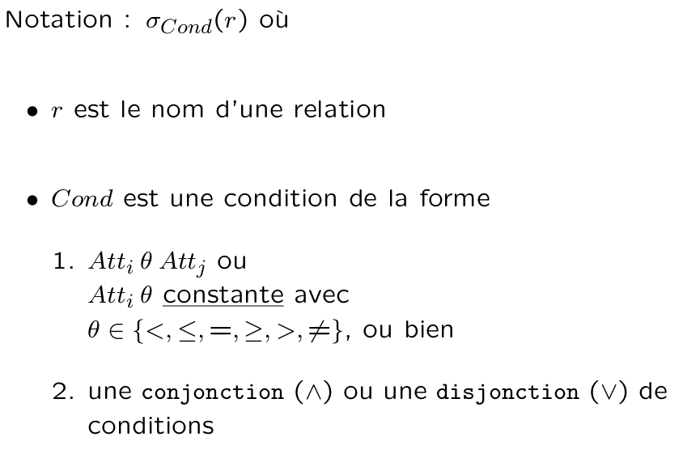
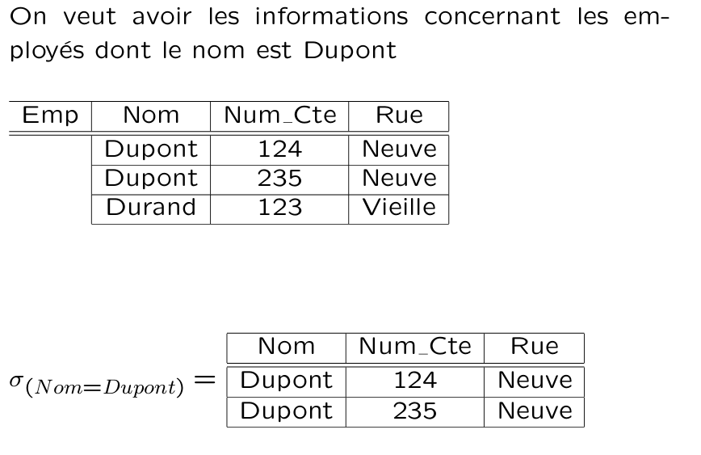
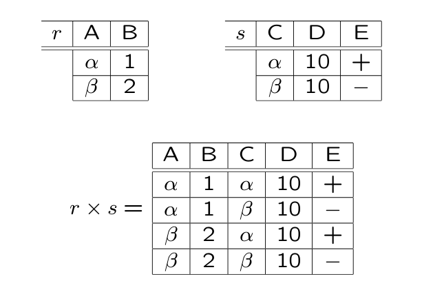
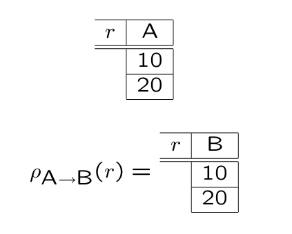
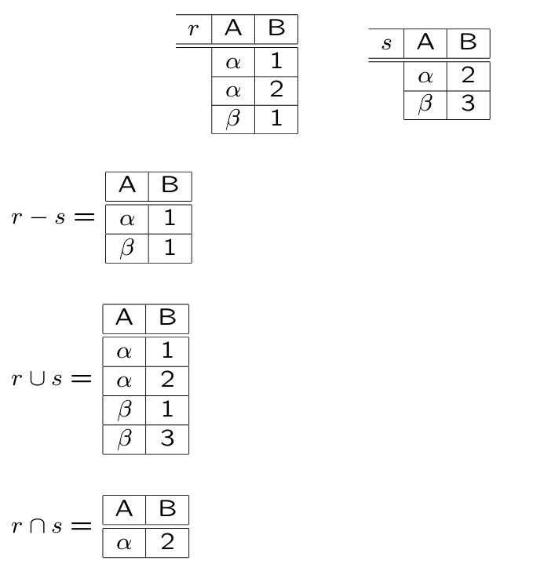

# Base de donnée

Mail : maabout@labri.fr

Réf PDF : www.labri.fr/~maabout/M1BI

## I-Définitions
### Une base de donnée relationnelle
Une relation est une **table** (tableau) où chaque colonne définie un **attribut** (ou champ) et chaque ligne désigne un **enregistrement** (tuple ou n-tuplet).
Chaque relation a un **nom**.


**Contraintes**:
+ 2 relations de la même BD ont forcément des noms différents.
+ 2 attributs de la même relation ont forcément des nom différents
Remarque : 2 attributs qui se trouvent dans 2 tables différentes peuvent avoir le même nom.

*Exemple*:
Dans une base, on peut avoir des tables:
+ Employé (**N°SS**,Nom,Ville,Salaire,*N°Service*)
+ Service (*N°Service*,Nom,Etage,**Responsable**)

Note : 
+ N°Service permet d'établir une relation entre l'employé et le service. 
+ Nom est différent entre les deux tables. 
+ Responsable devra utiliser un lien unique pour identifier un employé : deux attributs ont un nom différent mais ont la même info (N°SS).

### Système de gestion de base de données (SGBD)
Système (logiciel) qui permet de gérer des bases données.
+ Créer 
+ Modifier
+ Interroger 

*Exemple de SGBD*: MySQL, **Postgres**, Access, SQL Servor, Oracle , ...

## II-Langage de requête
### 1-Algebre relationnelle
Composée d'un ensemble d'**opérations**. Certaines sont **unaires** (une seule table comme paramètre), d'autres sont **binaires** (exemple : addition est une opération binaire).

#### 1.1-Projection
Prend une table et supprime certaines colonnes.

*Notation* : 


Noter que par défaut les doublons ne sont pas éliminés mais il est possible de spécifier une option afin de les éviter (50 employés à Pessac et 20 à Bx : Ville? on aura une table avec deux lignes Bx et Pessac).

#### 1.2-Sélection
Permet d'extraire des lignes d'une table qui satisfait une condition.

*Notation*:


*Exemple*:


#### 1.3-Produit cartésien:
Permet de **concaténer** chaque ligne d'une table à chaque ligne d'une deuxième table.

*Notation*:


*Remarques* : 
+ les attributs de la table résultant du produit sont ceux de 2 tables.
*Exemple* : R(A,B) * S(C,D,E) &rarr; Résultat(A,B,C,D,E)


Note : Nombre de ligne de Résultat = nombre de ligne de R * nombre de ligne de S

+ Cas où un même nom d'attribut apparaît dans les 2 tables : 

Ex : R(A,B) \* S(B,C) &rarr; Résultat(A,**R.B**,**S.B**,C)

+ le résultat de chaque opération de l'algèbre est une table. On peut donc combiner plusieurs opéartions successives.

Ex : afficher le nom des employés habitant Pessac.

&pi;<sub>Nom</sub> (&sigma;<sub>Vile = Pessac</sub>)(Employé)) &rarr; Résultat = {'Nom' :[Dupont,Martin]}

On a d'abord fait une sélection et on a ensuite appliqué la projection.

Ex : afficher le nom des employés qui travaillent au Service Compta. 
+ On extrait le n° du Service dont le nom est Compta.

&pi;<sub>N°Service</sub> (&sigma;<sub>NomService = Compta</sub>(Service)) &rarr; Res1 : {'N°Service' : [1]}

+ On combine Res 1 avec Employé :

Employé * Res1 &rarr; Res2 = {'N°SS':[123,321,312],'Nom':[Dupond,Dupont,Martin],'Ville':[Bx,Pessac,Pessac],'Employé.N°Service':[1,1,2],'Res1.N°Service':[1,1,1]}

+ On sélectionne le nom des employés où il y a égalité des N°Service.

&pi;<sub>Nom</sub> (&sigma;<sub>Employé.N°Service = Res1.N°Service</sub>(Res2)) &rarr; Res3={'Nom':[Dupond,Dupond]}

#### 1.4-Jointure
C'est un cas particulier de produit cartésien : 2 lignes sont concaténées si et seulement si elles ont les mêmes valeurs sur les attributs communs : 

*Notation* : 


*Exemple* :


#### 1.5-Renommage
Permet de changer le nom d'un ou de pluseiurs attributs.

*Notation* : 


*Exemple*


Ex : &pi;<sub>Nom</sub> (&sigma;<sub>Nom Service = Compta</sub>(&rho;<sub>Resp &rarr; N°SS</sub>(Service)&#8883;&#8882;Employé))

#### 1.6-Opération ensembliste : Union, Intersection, Différence
*Notation* : 


*Exemple* : 


Ex : 
+ Afficher le nom et N°SS des employés qui sont aussi étudiants 

&pi;<sub>N°SS,Nom</sub>(Employé) &#8898; &pi;<sub>N°SS,Nom</sub>(Etudiant)

+ Afficher les étduiants qui ne sont pas employés

&pi;<sub>N°SS,Nom</sub>(Etudiant) - &pi;<sub>N°SS,Nom</sub>(Employé)

+ Afficher les personnes qui ont une adresse mail à l'université

&pi;<sub>N°SS,Nom</sub>(Employé) &#8899; &pi;<sub>N°SS,Nom</sub>(Etudiant)

### SQL

+ Structured (ou Simple) Query Language
+ Standard qui permet d'exprimer des requêtes dans une BDD relationnelle.

Forme générale d'une requête SQL : 

|Clause     |Fonction   |
|-----------|-----------|
|SELECT     |Attributs  |
|FROM       |Tables     |
|WHERE      |Conditions |

+ FROM correspond au produit cartésien des tables mentionnées
+ WHERE correspond à la sélection sur le résultat du produit cartésien
+ SELECT correspond à la projection sur les résultats

**Exemples**:
+ Ex1

```sql
2- SELECT   NomImmeuble
1- FROM     Immeuble
```
est équivalent à : &pi;<sub>NomImmeuble</sub>(Immeuble)

Résultat : 

|NomImmeuble|
|-----------|
|Koudalou   |
|Barabas    |

+ Ex2
```sql
3- SELECT   NomImmeuble
1- FROM     Immeuble
2- WHERE    NomGerant = 'Doug'
```

est équivalent à : &pi;<sub>NomImmeuble</sub>(&sigma;<sub>NomGérant=Doug</sub>(Immeuble))

|NomImmeuble|
|-----------|
|Kandalou   |
|Koudalou   |
|Barabas    |
|.          |
|.          |
|.          |
|Barabas    |

*Remarque*: SQL n'élimine pas les doublons.

```sql
SELECT  NomImmeuble
FROM    Appart
```
Pour éliminer les doublons, on utilise la **clause DISTINCT**.

```sql
SELECT  DISTINCT    NomImmeuble
FROM    Appart
```

+ Ex3
La profession du gérant de Koudalou.

```sql
SELECT  Profession
FROM    Personne,Immeuble
WHERE   NomGerant = Nom AND
        Immeuble = 'Koudalou'
```
+ Ex4
La superficie de l'appart de Rachel

```sql
SELECT  Supercie
FROM    Appart,Occupant
WHERE   Appart.NomImmeuble=Occupant.NomImmeuble AND
        Appart.NAppart=Occupant.NOccupant AND
        NomOccupant = 'Rachel'
```

+ Ex5
La profession du gérant de l'appart de Rachel.

```sql
SELECT  Profession
FROM    Personne,Occupant,Immeuble
WHERE   NomOccupant = 'Rachel' AND
        Occupant.NomImmeuble = Immeuble.NomImmeuble AND
        NomGerant = Nom
```

**Opérateurs ensemblistes** : UNION,INTESECTION,MINUS

*Exemple*:
+ Ex1
N° et NomImmeuble des apparts non occupés

```sql
SELECT  NomImmeuble,NAppart
FROM    Appart
MINUS
SELECT  NomImmeuble,NAppart
FROM    Occupant
```

Cas particulier des tables utilisée plusieurs fois : 

*Exemple*:
Afficher les paires de noms de personnes qui habitent le même immeuble.

```sql
SELECT  O1.NomOccupant AS Nom1, O2.NomOccupant AS Nom2
FROM    Occupant O1, Occupant O2
WHERE   O1.NomImmeuble = O2.NomImmeuble AND
        O1.NomOccupant < O2.NomOccupant
```

+ Quand une même table est utilisée plusieurs fois dans la clause FROM, il faut associer une **variable** (O1 et o2) à chaque copie de cette table.
+ Quand une table est mentionnée une seule, on peut associer une variable à cette table pour simplifier l'écriture des conditions dans la clause WHERE.

#### Tri de résultat 

**Exemple** : Afficher le nom des occupants et l'année d'arrivée par ordre croissant de l'année d'arrivée

```sql
SELECT  NomOccupant,AnneeArrivee
FROM    Occupant
ORDER BY        AnneeArrivee
```
+ Pour trier par ordre décroissant, il faut utiliser :
```sql
ORDER BY DESC   AnneeArrivee
```
+ Pour trier le résultat par ordre croissant des noms, il faut utiliser :
```sql
ORDER BY        NomOccupant
```
+ Si pour 2 personnes on arrivait à la même année, on veut les trier par ordre alphabétique, on utilise : 
```sql
ORDER BY        AnneeArrivee,NomOccupant 
```

#### Fonctions d'agrégation

*Exemple*: Afficher le nombre d'appartements gérés par l'agence.

```sql
SELECT COUNT(NomImmeuble)
FROM    Appart
```
+ On compte le nombre de valeurs prises par l'attribut NomImmeuble dans la table Appart.
+ La fonction COUNT ne fait pas de distinction vis à vis des valeurs qui se répètent.

Dans l'exemple, le résultat sera : 

|COUNT(NomImmeuble)|
|------------------|
|6                 |

et non pas : 2

*Remarque*:
+ Pour cette requête, on aurait pu utiliser n'importe quel autre attribut.
+ On peut expliciter le sens du contenu de la colonne en la renommant.
+ Pour renommer le nom de l'attribut COUNT(NomImmeuble) : 
```sql
SELECT COUNT(NomImmeuble) AS NombreAppart
FROM    Appart
```

+ Autre fonction d'agrégation : MIN,MAX,AVG,...

*Exemple* : Afficher la superficie moyenne des apparts

```sql
SELECT  AVG(SUperficie)
FROM    Appart
```

#### Requêtes imbriquées

Dans la clause WHERE on peut utiliser des requêtes pour exprimer les conditons.

*Exemple* : Afficher les plus grands appartements (tous les attributs).

```sql
SELECT  A1.*
FROM    Appart A1
WHERE   Superficie = (SELECT MAX(A2.Superficie)
                     FROM   Appart A2)
```
+ **A1.\*** : tous les attributs de A1.

#### Regroupement : 

On peut vouloir appliquer les fonctions d'agrégations à des groupes d'enregistrements.

*Exemple* : Pour chaque immeuble, afficher son nom ainsi que la supericie maximum de ses apparts.

On veut donc construire des groupes de lignes de sorte que deux lignes sont dans le même groupe si et seulement si elles partagent la valeur du nom d'immeuble.

```sql
SELECT  NomImmeuble, MAX(Superficie)
FROM    Appart
GROUP BY NomImmeuble
```
Dans l'exemple, la clause GROUP BY construit deux groupes. Chacun correspond à une valeur de NomImmeuble (et il y a 2 valeurs distincts pour cet attribut).

A chacun de ces 2 groupes, la fonction MAX(Superficie) est appliqué.

**Résultat**:

|NomImmeuble|MAX(Superfcie)|
|-----------|--------------|
| Koudalou  |200           |
|Barabas    |250           |

+ Pour chaque immeuble, afficher son nom ainsi que le nombre de ses apparts ayant une superifcie supérieure à 100.

```sql
4 SELECT  NomImmeuble,COUNT(*)
1 FROM    Appart
2 WHERE   Superficie > 100
3 GROUP BY NomImmeuble
```

#### Condition sur les fonctions d'aggrégation

La clause WHERE permet de poser des conditons sur des lignes.

*Exemple* : Afficher le nom des immeubles qui ont plus de 3 apparts.

```sql
SELECT  NomImmeuble
FROM    Appart
GROUP BY NomImmeuble
HAVING   COUNT(*) > 3
```

#### Les valeurs NULL : 

+ Certains attributs peuvent ne pas être renseignées. Par exemple, on ajoute un appart pour lequel, on ne connaît pas encore la superficie. Dans ce cas, on dit que Superficie prend la valeur **NULL(inconnue)**.
+ La présence de valeurs NULL introduisent une troisième valeur logique pour l'évaluation des conditions (VRAI,FAUX,Inconnu).

*Exemple* : 

|Nom|Salaire|
|---|-------|
|A  |100    |
|B  |200    |
|C  |**NULL**|

```sql
SELECT  Nom
FROM    Employe
WHERE   Salaire > 100
```
Cette requête retourne : {Nom : B}. C ne fait pas partie du résultat car on ne connaît pas son salaire. 

Requête complémentaire : inférieure ou égal à 100. Retourne : {Nom : A}.

Si on fait une union de ses deux requêtes, on obtiendra A et B mais pas C.

*Exemple* : Afficher les employés pour lesquels on connaît le salaire. 
```sql
SELECT  *
FROM    Employe
WHERE   Salaire IS NOT NULL
```

*Remarque* : Ecrire Salaire <> NULL est **incorrect**. 

Afficher le salaire Moyen.

```sql
SELECT  SUM(Salaire)/Count(Nom)
FROM    Employe
```

Retourne la valeur 100 ((100+200)/3).

```sql
SELECT  AVG(Salaire)
FROM    Employe
```

Retourne 150 (ne prend pas en compte les NULL).


## III-Insertion, Suppression, Modification
### Modification de la structure d'une BD
## IV-Contrainte d'intégrité
## V-Conception d'une BD
